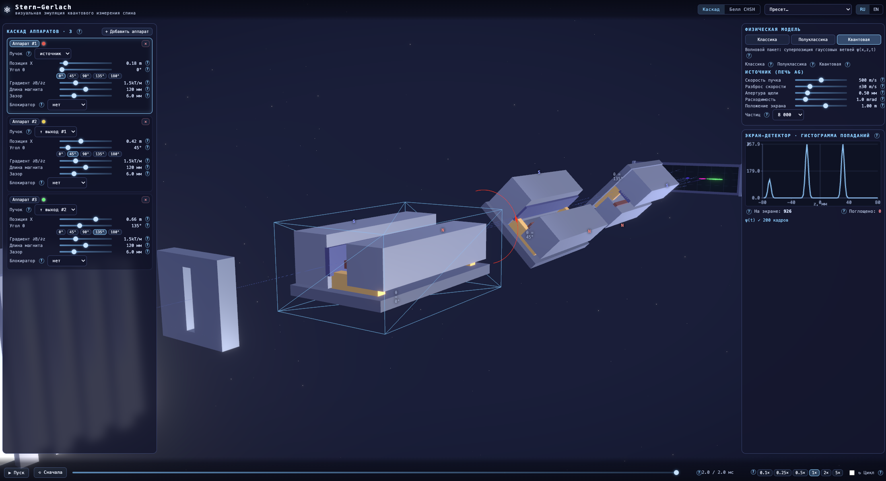
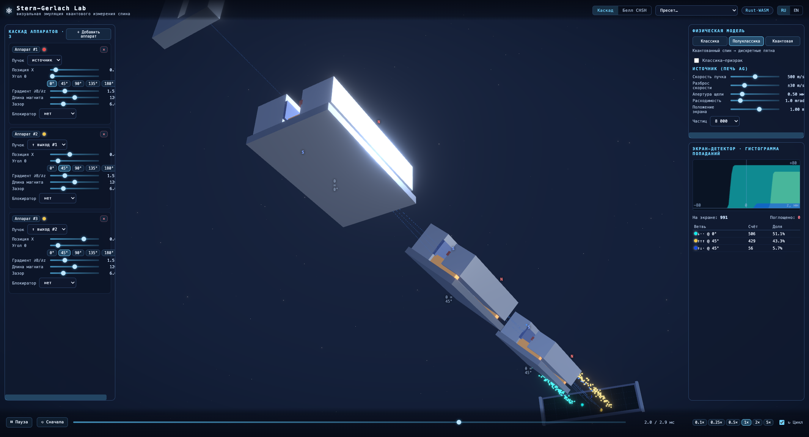
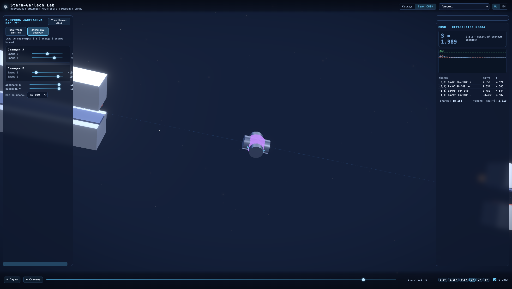
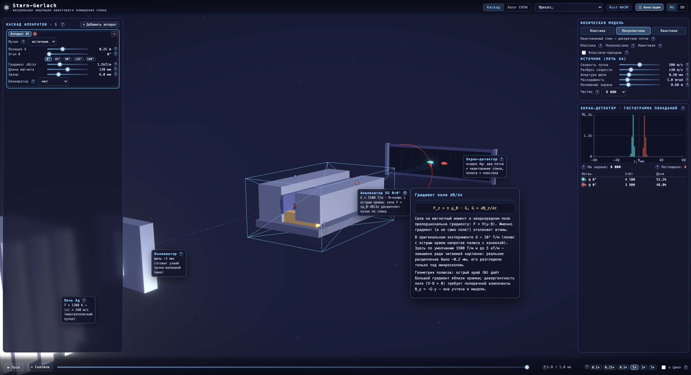
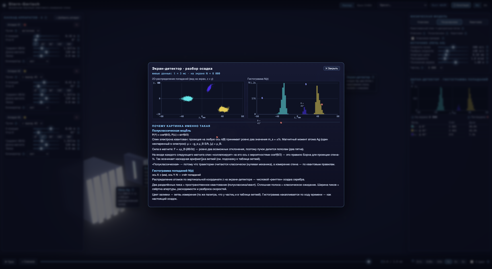

# ⚛ Stern-Gerlach

**[→ Открыть онлайн-демо](https://dmicheev.github.io/Stern_Gerlach/)**



Интерактивный 3D-симулятор двух знаковых опытов квантовой механики:

- **опыт Штерна — Герлаха (1922)** — пучок атомов серебра в неоднородном магнитном
  поле; каскады таких магнитов наглядно показывают правила квантовых измерений:
  проекцию, смену базиса, суперпозицию;
- **тест неравенства Белла (CHSH)** — запутанные пары и случайный выбор осей
  измерения, по мотивам эксперимента Хенсена (Hensen et al., Nature 526, 682 (2015)).

Симулятор задуман как учебное пособие: каждое устройство в 3D-сцене подписано, у
каждого параметра есть подсказка «?» с формулой, а физику можно переключать — от
классических «шариков со стрелками» до волнового пакета ψ.

## Быстрый старт

Нужны Node.js 18+ и pnpm. Rust не нужен — WASM-движок уже собран и лежит в
репозитории. Одной команды достаточно, зависимости установятся сами:

```bash
pnpm dev        # http://localhost:5173 (аналогично pnpm start)
```

Пошаговая инструкция для любой ОС (включая установку Node.js и pnpm с нуля) и FAQ:
**[docs/INSTALL.md](docs/INSTALL.md)**.

## Физика за две минуты

### Опыт Штерна — Герлаха

У атома серебра есть магнитный момент μ, связанный со спином валентного электрона.
В неоднородном магнитном поле на атом действует сила `F = ∇(μ·B)`: траектория
зависит от того, как момент ориентирован относительно градиента поля.

- **Классика**: моменты атомов из печи ориентированы равномерно во все стороны,
  отклонения принимают все промежуточные значения — на экране должна быть
  сплошная полоса.
- **Квантовая механика**: проекция спина ½ на ось магнита принимает только два
  значения, ±ħ/2, — пучок расщепляется ровно на два пятна. Именно это и увидели
  Штерн и Герлах в 1922 году.

Один аппарат измеряет проекцию спина на одну ось n(θ). Каскад аппаратов
демонстрирует правила последовательных измерений: если из первого магнита (ось z)
отобрать ветвь ↑ и запустить её во второй такой же SGz — все атомы снова дадут ↑.
Но если второй аппарат повернуть на 90° (SGx) — снова 50/50: измерение в другом
базисе стирает предыдущую информацию. Это и есть проекция состояния.

### Неравенство Белла (CHSH)

Можно ли объяснить квантовые вероятности «заранее заготовленными» значениями
спина — скрытыми параметрами? Неравенство Белла превращает этот спор в измеримый
эксперимент.

Схема CHSH: источник рождает пары в запутанном состоянии |ψ⁻⟩ и разносит их к
двум станциям, A и B. Перед самым прилётом каждая станция случайно выбирает одну
из двух осей измерения: a₀ или a₁ на A, b₀ или b₁ на B (случайность выбора
принципиальна — так «запрещается» подгонка ответа). Исходы обоих измерений ±1;
для каждой пары осей считается корреляция E(a,b) = ⟨x·y⟩.

Любая локальная теория со скрытыми параметрами обязана соблюдать неравенство CHSH:

```
S = E(a₀,b₀) + E(a₀,b₁) + E(a₁,b₀) − E(a₁,b₁),   |S| ≤ 2
```

Квантовая механика для синглета даёт `E(a,b) = −cos(θa − θb)`, и при удачных
углах S доходит до 2√2 ≈ 2.83 — неравенство нарушается. Реальные эксперименты
(первый без «лазеек» — Hensen et al., 2015) подтверждают квантовую механику:
скрытых параметров нет.

## Режим 1. Каскад — дерево пучков

Печь, коллиматор, магниты и экран в 3D. Аппараты ставятся на конкретный пучок:
каждый магнит делит попавший в него пучок на два выхода (↑/↓) со своими
траекториями; следующий магнит привязывается к выбранной ветви (селектор «Пучок»
в карточке), встаёт на её геометрию и видит только её частицы. Так растёт дерево
любой глубины: SGz → ветвь ↑ → SGx → …

- лучи всех ветвей рисуются в 3D до экрана; позиции магнитов на ветвях
  вычисляются из отклонения;
- на экране накапливается «осадок»; рядом — гистограмма попаданий, таблица ветвей
  и таймлайн;
- «классика-призрак» — полоса, которую дала бы классика, поверх дискретных пятен;
- блокиратор любого порта — фильтр спина;
- пресеты: «Оригинал 1922 (Ag)», «Классические ожидания», «Каскад SGz → SGx»,
  «Фильтр спина + суперпозиция», «Три аппарата по 45°», «Квантовый волновой пакет».



## Режим 2. Белл CHSH — запутанные пары

Идеализированная симуляция эксперимента CHSH: источник пар |ψ⁻⟩ в центре, две
станции (A и B) с двумя осями каждая, случайный выбор оси на каждую пару
(имитация квантового генератора случайных чисел, как в реальном эксперименте),
двухпортовые детекторы и живая статистика.

Что можно делать:

- **переключать модель**: квантовая `E(a,b) = −cos(θa−θb)` (S до 2√2) или
  локальный реализм со скрытыми параметрами φ (исходы `x = sign[cos(θa−φ)]`,
  `y = −sign[cos(θb−φ)]`, S ≤ 2 при полной детекции) — та же установка, другая
  «физика»: прямая демонстрация, почему запутанность не сводится к предопределённым
  значениям;
- **крутить углы** a₀, a₁, b₀, b₁; пресет «Hensen 2015»: 0°/90° и ±139.7°;
- **портить детекторы** слайдерами: эффективность η и видность V;
- **следить за статистикой**: живая таблица корреляций E(a,b) по четырём
  комбинациям осей и бегущий график S(N) с отметками 2 и 2√2.



⚠️ **Учебная модель, а не безлазеечный тест.** Статистика CHSH строится только
по парам, где сработали оба детектора (post-selection — отбор событий).
Гарантия S ≤ 2 для локальных моделей доказана при учёте *всех* пар; после отбора
доказательство опирается на предположение честной выборки (fair sampling): при
η < 1 локальная модель в принципе может показать S > 2 — не потому, что локальный
реализм нарушен, а потому, что «неудобные» события отброшены (дыра детекции).
Симуляция именно **демонстрирует** эту дыру, а не закрывает её: отбраковка здесь
честно случайна, поэтому локальная модель в среднем остаётся ≤ 2. Пространственноподобное
разделение станций, времена переключения осей и память детекторов не моделируются
(оси просто разыгрываются на каждую пару). Без «лазеек» был реальный эксперимент
Хенсена 2015 года, а не эта модель.

## Три физические модели каскада

Чем отличается расчёт — простыми словами:

| | Классика | Полуклассика | Квант |
|---|---|---|---|
| Атом | шарик со «стрелкой» μ | шарик с квантовым спином | волновой пакет ψ |
| В магните | ничего не происходит: сила зависит от ориентации стрелки | «бросок монетки», спин прилипает к ±n | пакет делится на суперпозицию ветвей |
| На экране | сплошная полоса | два пятна (накопление Монте-Карло) | два расплывающихся пятна \|ψ\|² |

**Классика — «шарики со стрелками».** Атом — намагниченный шарик, у которого
стрелка (магнитный момент μ) торчит в случайную сторону и не меняется в полёте.
Никакого кубика: сила `F = ∇(μ·B)` непрерывно зависит от того, куда стрелка
смотрит, и каждый атом отклоняется ровно на «свою» величину. Стрелки распределены
равномерно — отклонения заполняют диапазон непрерывно, получается сплошная полоса.

**Полуклассика — «шарики с кубиком».** Траектории по-прежнему классические, но
спин живёт по квантовым правилам. На входе в магнит разыгрывается исход:
`P(↑) = (1 + s·n)/2` (правило Борна), спин мгновенно «прилипает» к ±n (коллапс),
и дальше сила ±μ_B·G ведёт шарик по обычной траектории. Картина на экране —
накопление тысяч таких случайных прогонов (Монте-Карло).

**Квант — «размазанная волна, которая делится, а не выбирает».** Отдельных атомов
нет: весь пучок — один волновой пакет ψ. В магните ничего не выбирается: пакет
расщепляется на две ветви с весами cos²(θ/2) и sin²(θ/2), и обе живут
одновременно — атом как бы проходит через оба порта сразу. Блокиратор не ловит
шарики, а выжигает целую ветвь (проекция состояния). Центры ветвей движутся как
классические частицы (теорема Эренфеста), огибающие расплываются со временем.
Честная дисперсия огибающей складывается из трёх слагаемых — начальной ширины
щели, классического разброса скоростей и собственного квантового расплывания
σ ∝ ħt/2mσ₀; для тяжёлых атомов серебра квантовое слагаемое — нанометры на фоне
миллиметров классического разброса, и вклад каждого слагаемого виден в панели
статистики. Попадания на экран сэмплируются из плотности |ψ|².

**Что общего.** При большом числе частиц гистограмма полуклассики сходится ровно
к профилю |ψ|² квантовой модели — вероятность cos²(θ/2) одна и та же. Различается
«онтология посередине»: полуклассика говорит «атом уже где-то конкретно, мы просто
не знаем где», квант — «атом реально в суперпозиции, пока его не поймал экран».
Оговорка: в квантовом режиме ветви складываются по плотностям без
интерференционных членов — модель про суперпозицию и проекцию, а не про фазы.

## Мини-лаборатория: что попробовать

1. **Полоса против пятен.** Пресет «Оригинал 1922 (Ag)»: переключайте модели —
   классика даёт сплошную полосу, полуклассика и квант — два пятна.
2. **Повторное измерение.** Постройте SGz → ветвь ↑ → SGz: из отобранных ↑ все
   снова уходят ↑. Закройте блокиратором один порт — получите поляризованный пучок.
3. **Смена базиса.** Тот же каскад, но второй аппарат поверните на 90°: снова
   50/50 — измерение по x стёрло информацию о z.
4. **Вероятности cos²(θ/2).** Пресет «Три аппарата по 45°»: каждый следующий
   аппарат делит пучок в отношении cos²(22.5°) ≈ 85% / 15%.
5. **Нарушение Белла.** В режиме CHSH: квантовая модель при η = V = 1 даёт
   S ≈ 2.83, локальный реализм — не больше 2. Затем уменьшайте видность V: при
   V < 1/√2 ≈ 0.71 нарушение исчезает и у квантовой модели.

## Интерфейс и управление

- **ЛКМ по магниту** — выбор; появляется гизмо вращения вокруг оси пучка
  (шаг привязки 5°)
- **Колесо мыши / перетаскивание** — камера (OrbitControls)
- Слайдеры каскада: угол θ, градиент ∂B/∂z, длина магнита, зазор, блокиратор
- Источник: скорость пучка, разброс, апертура, расходимость; положение экрана
- Каждое устройство подписано карточкой (печь, коллиматор, анализаторы с живыми
  значениями θ и G, экран-детектор, источник пар и станции в режиме Белла);
  каждый параметр, гистограмма и число имеют «?»-подсказку с формулами
  и объяснением разницы подходов (RU/EN)



- **Клик по экрану-детектору** (каскад) или по детекторам станций (Белл) открывает
  разбор: 2D-распределение попаданий (z × y), гистограмму N(z) в каскаде или
  исходы по осям с равными долями ~50% в Белле, живые счётчики и объяснение,
  почему картинка именно такая — текст зависит от активной модели.



## Как устроено внутри

```
frontend/                React 18 + TypeScript + Vite
├── src/scene/           three.js через React Three Fiber: печь, коллиматор, магниты
│                        (вращение гизмо), экран (CanvasTexture), частицы
│                        (InstancedMesh), тепловая карта ψ (DataTexture, additive)
├── src/physics/         физическое ядро (см. ниже), Web Worker, загрузка WASM
├── src/ui/              панели: каскад, источник, режимы, статистика, таймлайн
├── src/state/           zustand-хранилище (конфигурация — единый источник истины) + пресеты
└── src/i18n/            RU/EN словари (react-i18next)

physics-wasm/            Rust-крейт sg-physics → wasm-bindgen → frontend/src/physics/wasm-pkg
```

### Физическое ядро

Единый интерфейс движка; реализация выбирается во время выполнения:

- **Rust → WASM** (`physics-wasm/`) — основной движок: интегрирование траекторий
  методом Рунге — Кутты 4-го порядка, детерминированный генератор случайных чисел
  PCG32, компактный бинарный протокол (единственное копирование — на выходе из
  wasm-памяти; дальше JS работает с TypedArray-views поверх буфера). Возвращает
  `ArrayBuffer` с массивами f64: покадровые позиции видимых в полёте частиц
  (подвыборка ~400 для анимации, остальные — только в статистике), координаты
  попаданий и истории измерений спина.
- **Резервная реализация на TypeScript** (`src/physics/engine.ts`) — эталонная
  реализация той же математики (та же последовательность вызовов генератора
  случайных чисел); включается, если WASM недоступен, и используется в
  юнит-тестах. Индикатор в шапке показывает активный движок: `Rust·WASM` или `JS`.

Инвариант проекта: **при одинаковом конфиге и seed реализации JS и WASM обязаны
давать идентичный результат** — это проверяется parity-тестом
(`src/physics/__tests__/parity-wasm.test.ts`) на наборе фиксированных конфигураций.

Детали моделей:

- **Поле каскада** — композит аналитических полей аппаратов: в локальной системе
  магнита `B = env(x)·win(r⊥)·(0, −G·y, B₀+G·z)` (без дивергенции и ротора в
  первом порядке), повёрнутой на θ вокруг оси пучка. Поле для рендера (`fieldAt`)
  и сила в движке (`forceClassical`) — связанные, но не тождественные приближения:
  градиент окна полюсов win(r⊥) в силе намеренно опущен (мал вблизи оси), поэтому
  вдали от оси F ≠ ∇(μ·B_rendered) — см. комментарий в `src/physics/field.ts`.
- **Печь** задаёт максвелловское распределение скоростей, апертуру и
  расходимость. Все величины — в СИ (атом серебра, магнетон Бора). Масштаб
  сцены: 1 единица = 1 мм.
- **Квантовый режим** — аналитическая аппроксимация волнового пакета
  («Pauli-inspired»), а не численное решение уравнения Паули: пакет рождается в
  щели, на входе каждого магнита расщепляется на две гауссовы ветви с весами
  cos²(θ_rel/2); центры ветвей следуют эренфестовской (классической) кинематике.
  Ветви не несут относительной фазы и складываются по плотностям — интерференции
  в модели нет. Слабые ветви (< 1e-10) отбрасываются, отброшенная масса явно
  сообщается. ψ(x,z,t) рисуется аддитивной тепловой картой (синий/оранжевый —
  знак проекции спина).

## Сборка и публикация

```bash
pnpm build      # статическая сборка → frontend/dist (зависимости поставятся сами)
```

- **GitHub Pages** — автосборка настроена (`.github/workflows/deploy.yml`):
  Settings → Pages → Source: GitHub Actions
- **Netlify / Vercel / свой сервер** — просто разместите содержимое
  `frontend/dist` (подробности — в [docs/INSTALL.md](docs/INSTALL.md))

После правок Rust-кода WASM нужно пересобрать, иначе в браузере останется старая
физика:

```bash
./scripts/build-wasm.sh              # переносимо: rustup (target wasm32) + wasm-pack
# или, на macOS/Apple Silicon с поломанным двойным rustc:
./scripts/build-wasm-macos-arm64.sh  # требует rustup-тулчейн + brew install lld
```

Подробности и решение проблем: `docs/troubleshooting-wasm.md`.
Без Rust-тулчейна приложение всё равно работает на резервной JS-реализации.

## Тесты

```bash
pnpm test           # vitest (53 теста, физика TS) + cargo test (7 тестов, физика Rust)
```

Что проверяется:

- физика каскада: симметрия двух пятен и совпадение расщепления с аналитикой;
  сплошная полоса в классике; равные четыре ветви при 90°; вероятности cos²(θ/2);
  нормировка ψ; детерминизм;
- Белл: S ≈ 2√2 у квантовой модели и S ≤ 2 у локальной; корреляции −cosΔ;
  честный пропуск событий при η < 1; исчезновение нарушения при V < 0.71;
- инженерия: parity JS ↔ WASM (одинаковый конфиг + seed → идентичный результат
  на 5 конфигурациях); инварианты (P↑+P↓ = 1, сохранение полной вероятности
  ветвей с учётом отброшенной массы, ⟨z⟩ = 0 в классике); инвариантность
  поворота расщепления для 0°/45°/90°/135°/180°; guard от устаревших результатов
  worker'а (гонка «медленный ответ перезаписывает новый»).

## Приближения и ограничения — честно

- **Полуклассика**: коллапс спина на входе магнита; прецессия Лармора не
  анимируется (спин «прилипает» к оси n(θ) после измерения).
- **Классика**: постоянный μ̂ (прецессионное усреднение); краевые эффекты окна
  полюсов не учитываются; сила в движке и отрисовываемое поле — согласованные,
  но не тождественные приближения.
- **Квант**: аналитическая аппроксимация, не численное решение уравнения Паули;
  дифракция на щели моделируется гауссовой огибающей; фаз у ветвей нет —
  интерференционные члены отсутствуют по построению; наблюдаемое расплывание
  доминируется классическим разбросом скоростей; попадания сэмплируются из
  плотности |ψ|², а не из вероятностного тока `j = ħ/m·Im(ψ*∇ψ)`.
- **Белл/CHSH**: идеализированная статистическая модель; post-selection и дыра
  детекции — см. врезку в разделе о режиме Белла.
- **Масштаб**: градиент по умолчанию (1500 Т/м) завышен против исторического
  эксперимента (~10³ Т/м) ради читаемой картинки — реальное расщепление было
  ~0.2 мм.
